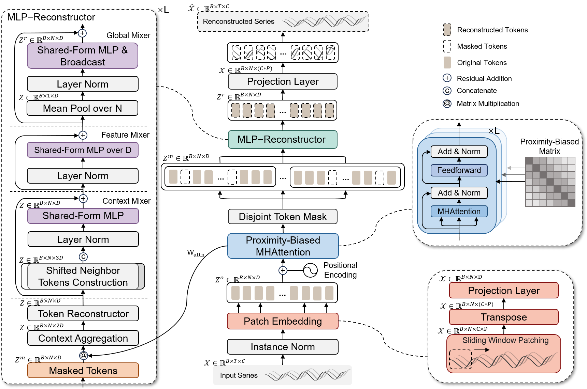
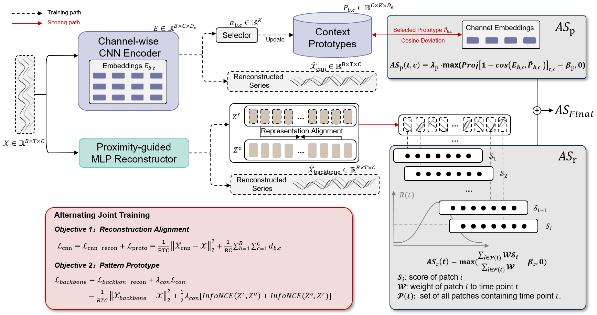
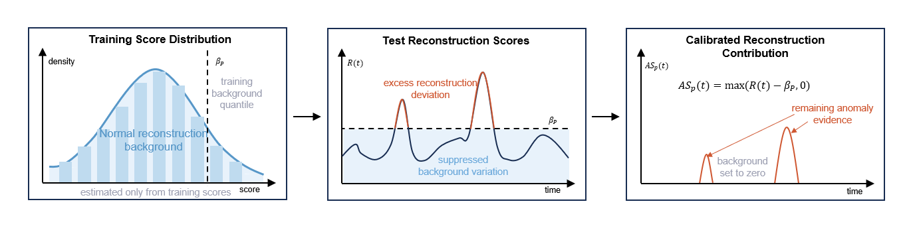

# PAMM: Prototype-Assisted Multivariate Time-Series Anomaly Detection

This folder contains the supplementary implementation and illustrations for the proposed PAMM model. In the current TSB-AD experimental interface, PAMM is invoked with the model name `PAMM`.

## Model Overview

PAMM is designed for multivariate time-series anomaly detection. It combines a proximity-guided reconstruction backbone with a prototype-assisted temporal-pattern branch, so that anomaly scores can reflect both reconstruction inconsistency and channel-wise pattern deviation.



The backbone first converts the input series into sliding-window patches and applies instance normalization. The resulting tokens are encoded by proximity-biased multi-head attention, where nearby temporal positions receive stronger inductive bias. A disjoint token masking strategy is then used to train the model to reconstruct masked temporal tokens. The MLP-Reconstructor contains context-, feature-, and global-mixing modules, allowing the model to recover local temporal structure while preserving cross-channel interactions.



In parallel, PAMM introduces a prototype-assisted branch. This branch maps each channel window into a compact embedding and compares it with learnable context prototypes. During training, the CNN branch is optimized by reconstruction alignment and prototype deviation losses. During scoring, the selected prototype provides a context-aware reference pattern, and the cosine deviation between the channel embedding and its selected prototype is used as additional anomaly evidence.



To reduce false alarms caused by normal reconstruction fluctuations, PAMM estimates a training-background score threshold from normal training scores. At inference time, only the excess part above this background level contributes to the final anomaly score. This calibration is applied to the reconstruction branch and the CNN pattern branch before score fusion.

## Getting Started

The code is intended to be integrated into the TSB-AD codebase.

1. Place the provided model code under the TSB-AD project root.

2. Make sure the TSB-AD datasets and file lists are available under the standard TSB-AD paths:

   ```text
   Datasets/TSB-AD-M
   Datasets/File_List
   ```

3. Run the representative multivariate benchmark with `test/run_representative_multivariate.py`.

   A typical evaluation command is:

   ```bash
   python test/run_representative_multivariate.py \
     --split M \
     --phase eval \
     --datasets MSL SMAP SMD Genesis CATSv2 \
     --models PAMM \
     --overwrite \
     --score_dir test/scores/multi \
     --metrics_dir test/metrics/multi
   ```

4. Optional PAMM-specific hyperparameters can be passed through the runner:

   ```bash
   python test/run_representative_multivariate.py \
     --split M \
     --phase eval \
     --datasets MSL SMAP SMD Genesis CATSv2 \
     --models PAMM \
     --pamm_win_size 64 \
     --pamm_patch_size 16 \
     --pamm_patch_stride 2 \
     --pamm_batch_size 64 \
     --pamm_epochs 20 \
     --pamm_cnn_pattern_enabled 1
   ```

The script saves anomaly scores, auxiliary channel-level scores, prototype-analysis files, and metric summaries under the specified score and metric directories.

## Acknowledgement

This codebase builds on ideas and components from the time series forecasting community. We appreciate the following repositories for their valuable code and efforts:

- TSB-AD: https://github.com/TheDatumOrg/TSB-AD